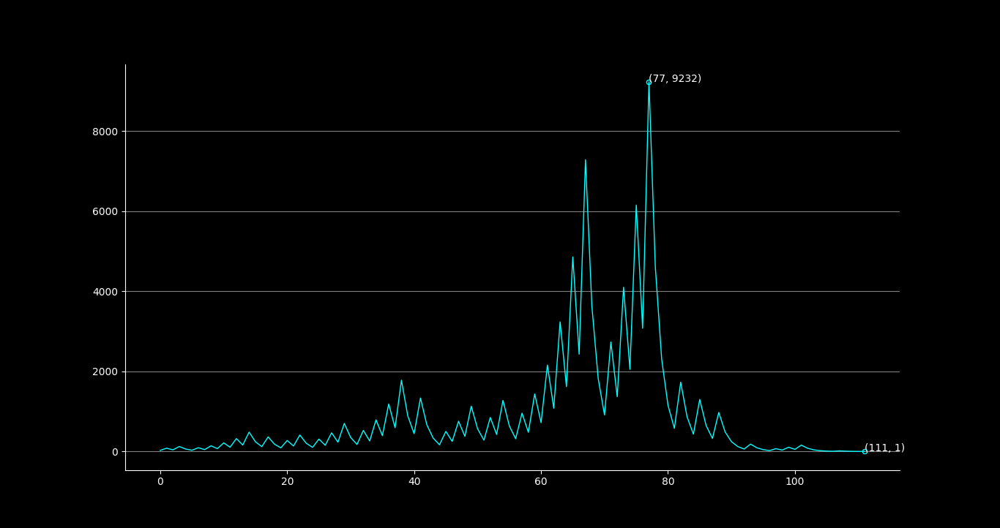
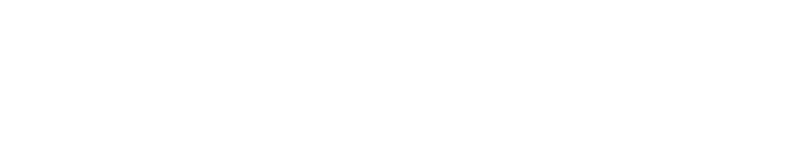

<h4 align="center"> The Collatz conjecture is one of the most famous unsolved problems in mathematics. The conjecture asks whether repeating two simple arithmetic operations will eventually transform every positive integer into 1. </h4>

n = 27

---

- [Collatz Conjecture (Wikipedia)](https://en.wikipedia.org/wiki/Collatz_conjecture)
- [Collatz Conjecture](https://github.com/cx0y/collatz/blob/main/docs/collatz_conjecture.pdf)
- [Pseudo Random Number Generators Based on Collatz Conjecture](https://github.com/cx0y/collatz/blob/main/docs/Pseudo_random_number_generators_based_on.pdf)
- [Wild and Wooley Numbers](https://github.com/cx0y/collatz/blob/main/docs/lagarias97.pdf)
- [Multiplicative Semigroups Related to the 3x + 1 Problem](https://github.com/cx0y/collatz/blob/main/docs/semigroups.pdf)
